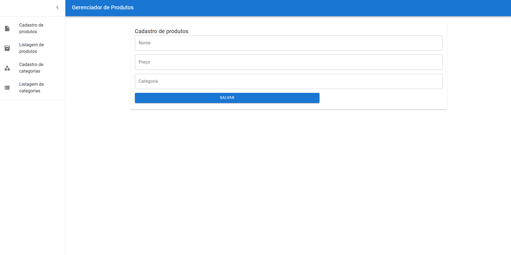
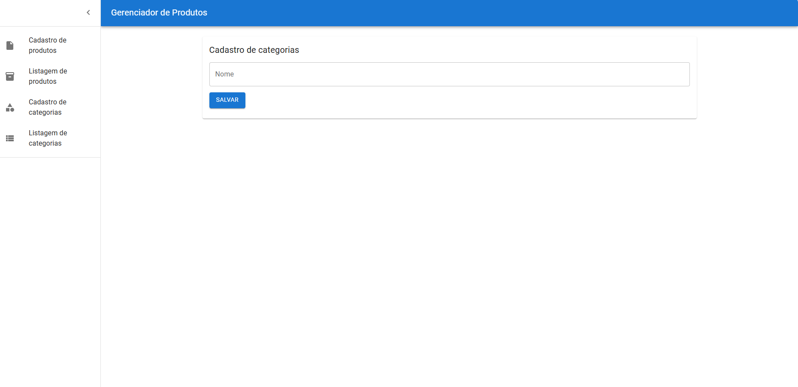
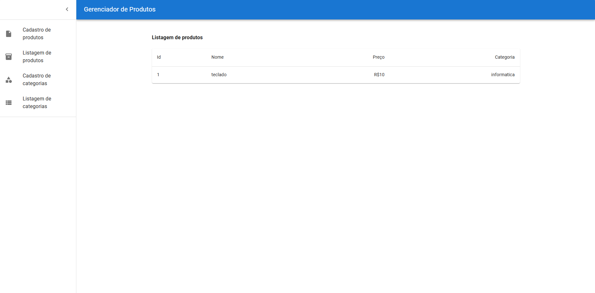
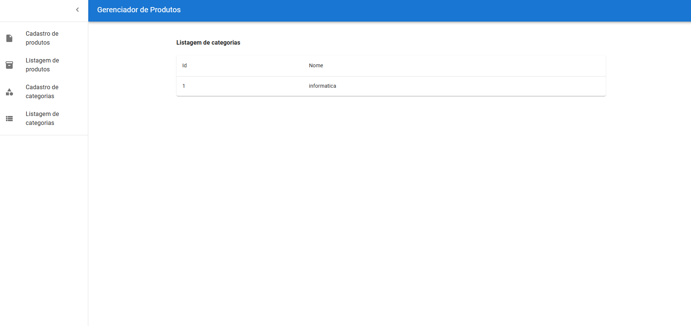

# 📦 Sistema de Gerenciamento de Almoxarifado 🛠️

Bem-vindo ao **Sistema de Gerenciamento de Almoxarifado**! Este projeto foi desenvolvido com **React**, **Node.js** e **MySQL**, e tem como objetivo facilitar o controle de estoque de produtos de maneira simples e eficiente. 😎

## 🚀 Tecnologias Utilizadas

- **Frontend**: React ⚛️
- **Backend**: Node.js (Express) 🌐
- **Banco de Dados**: MySQL 🗃️
- **Bibliotecas de Suporte**: Axios 📡, CORS 🌍
- **Autenticação**: JWT 🔑

## ✨ Funcionalidades

- **📦 Cadastro de Produtos**: Adicione e organize os produtos no estoque com nome, categoria, quantidade e preço.
- **🔍 Visualização de Estoque**: Veja todos os produtos com filtros para buscar por nome, categoria ou quantidade.
- **📈 Controle de Entradas e Saídas**: Registre as movimentações de estoque e atualize as quantidades.
- **🔒 Autenticação de Usuários**: Apenas usuários autenticados têm acesso às funcionalidades administrativas.
- **🖥️ API RESTful**: Comunicação eficiente entre frontend e backend por meio de API.

## Imagens

